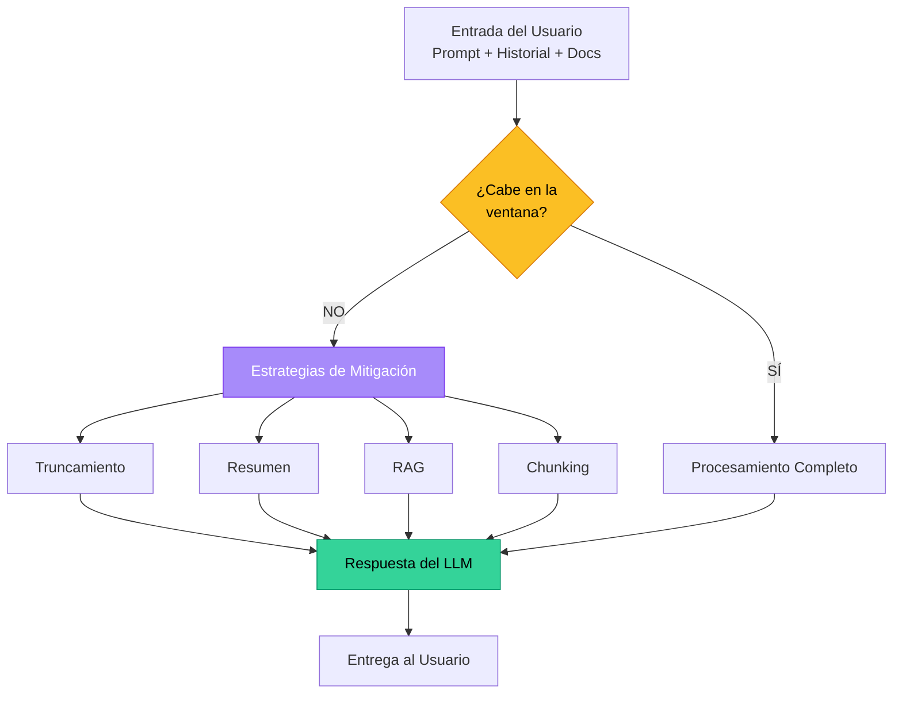
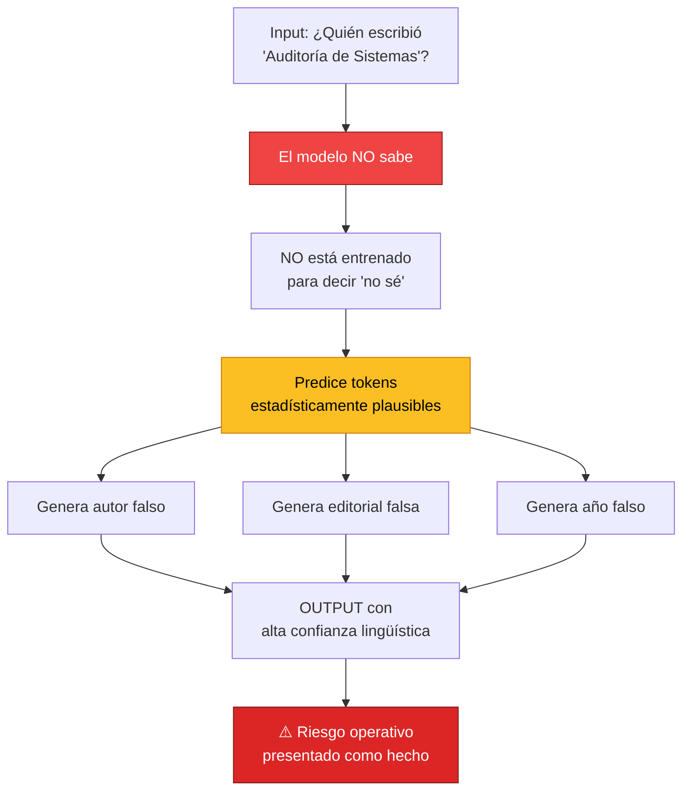
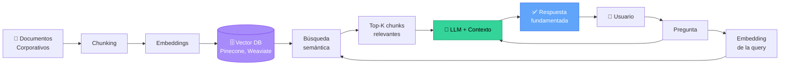

# Los 5 Pilares de la IA

## Que Todo Líder Debe Dominar

<div class="text-lg opacity-75 mt-4">
Del entendimiento conceptual a la ventaja competitiva organizacional
</div>

<div @click="$slidev.nav.next" class="mt-12 py-1" hover:bg="white op-10">
  Presiona <kbd>Espacio</kbd> para continuar <carbon:arrow-right />
</div>

<div class="abs-br m-6 text-xl">
  <button @click="$slidev.nav.openInEditor()" title="Open in Editor" class="slidev-icon-btn">
    <carbon:edit />
  </button>
  <a href="https://github.com/yosef7" target="_blank" class="slidev-icon-btn">
    <carbon:logo-github />
  </a>
</div>

<!--
Bienvenida ejecutiva. El objetivo de esta presentación es cerrar la brecha entre
quienes usan IA superficialmente y quienes la lideran con criterio técnico.
Duración estimada: 45-60 minutos + 15 min de Q&A.
-->

---
transition: fade-out
---

# El Gancho Estratégico

<div class="mt-8 text-lg">

Según el **Gartner AI Hype Cycle 2025** y el marco **ISO/IEC 42001:2023**:

</div>

<div class="grid grid-cols-2 gap-6 mt-8">

<div class="p-4 rounded border border-primary/30 bg-primary/10">
<div class="text-4xl font-bold text-blue-400">78%</div>
<div class="text-sm mt-2">de las organizaciones experimentan con IA generativa</div>
</div>

<div class="p-4 rounded border border-primary/30 bg-primary/10">
<div class="text-4xl font-bold text-orange-400">12%</div>
<div class="text-sm mt-2">cuentan con líderes que comprenden los fundamentos técnicos</div>
</div>

</div>

<div class="mt-20 text-xl italic text-center">

> ¿Está usted **liderando** la adopción de IA en su organización…
> 
> o simplemente está siendo **arrastrado** por la corriente?

</div>

<style>
h1 {
  background-color: #2B90B6;
  background-image: linear-gradient(45deg, #4EC5D4 10%, #146b8c 20%);
  background-size: 100%;
  -webkit-background-clip: text;
  -moz-background-clip: text;
  -webkit-text-fill-color: transparent;
  -moz-text-fill-color: transparent;
}
</style>

<!--
Apertura inspiracional. Presentar el contexto de industria y el desafío de liderazgo.
La pregunta retórica establece el tono: hoy cerramos esa brecha.
-->

---
transition: slide-up
level: 2
---

# Agenda Ejecutiva

<div class="grid grid-cols-2 gap-6 mt-6">

<div v-click class="p-4 rounded border border-blue-500/40 bg-blue-500/10">
<div class="text-2xl font-bold">1️⃣ Tokens</div>
<div class="text-sm opacity-75 mt-1">La unidad atómica del lenguaje IA</div>
</div>

<div v-click class="p-4 rounded border border-green-500/40 bg-green-500/10">
<div class="text-2xl font-bold">2️⃣ Context Window</div>
<div class="text-sm opacity-75 mt-1">La memoria operativa del modelo</div>
</div>

<div v-click class="p-4 rounded border border-yellow-500/40 bg-yellow-500/10">
<div class="text-2xl font-bold">3️⃣ Temperature</div>
<div class="text-sm opacity-75 mt-1">El dial creatividad vs. precisión</div>
</div>

<div v-click class="p-4 rounded border border-red-500/40 bg-red-500/10">
<div class="text-2xl font-bold">4️⃣ Hallucination</div>
<div class="text-sm opacity-75 mt-1">El riesgo operativo silencioso</div>
</div>

<div v-click class="p-4 rounded border border-purple-500/40 bg-purple-500/10 col-span-2">
<div class="text-2xl font-bold">5️⃣ RAG — Retrieval-Augmented Generation</div>
<div class="text-sm opacity-75 mt-1">La arquitectura que convierte la IA en activo empresarial</div>
</div>

</div>

<!--
Mostrar el roadmap de la sesión. Cada pilar conecta con un KPI empresarial específico.
-->

---
layout: section
---

# Pilar 1: Tokens

## La unidad atómica del lenguaje en IA

---

# ¿Qué es un Token?

<div class="grid grid-cols-2 gap-8 mt-6">

<div>

### Definición Ejecutiva

Un **token** es la unidad mínima de procesamiento lingüístico que un modelo de IA interpreta.

<v-clicks>

- No son palabras
- No son letras
- Son **fragmentos semánticos** optimizados estadísticamente
- Determinan **costo, velocidad y memoria**

</v-clicks>

</div>

<div v-click>

### Ejemplo Visual

```
"La auditoría de sistemas"
        ↓ tokenización
["La", " audit", "oría", " de", " sistemas"]
        ↓
       5 tokens
```

<div class="mt-4 p-3 rounded bg-blue-500/10 border border-blue-500/30">
💡 <strong>Insight:</strong> El español consume ~2x más tokens que el inglés para el mismo significado.
</div>

</div>

</div>

<!--
Anclar el concepto a algo tangible. La tokenización es la base del costo y rendimiento.
-->

---

# Equivalencias Prácticas por Idioma

| Idioma | Tokens por palabra | Ejemplo | Tokens |
|---|---|---|---|
| 🇺🇸 Inglés | ~1.3 | "Innovation" | 1 |
| 🇪🇸 Español | ~2.0 | "Innovación" | 3 |
| 🐍 Python | ~8–15 por línea | `def auditar():` | 4 |
| 📄 Markdown | ~1.5 por palabra | `# Título` | 2 |

<div v-click class="mt-1 p-1 rounded bg-yellow-500/10 border border-yellow-500/40">

### 🏢 Caso Real — Industria Aérea

Una aerolínea procesa **2M de consultas/mes** vía chatbot. Optimizando prompts:
- Reducción de tokens: **-37% anual**
- Ahorro estimado: <span v-mark.circle.orange="2">**USD 84,000/año**</span>
- Sin pérdida de calidad operativa

</div>

<!--
Tangibilizar el impacto financiero. El idioma NO es neutral en costos de IA.
-->

---
layout: image-right
image: https://cover.sli.dev
---

# Demo Técnica: Tokenización

```python {all|1-2|4-5|7-12|14-15|all} twoslash
import tiktoken

# Encoder oficial (cl100k_base)
encoder = tiktoken.get_encoding("cl100k_base")

texto_es = "La auditoría con IA reduce costos."
texto_en = "AI auditing reduces costs."

tokens_es = encoder.encode(texto_es)
tokens_en = encoder.encode(texto_en)

print(f"🇪🇸 ES: {len(tokens_es)} tokens")
print(f"🇺🇸 EN: {len(tokens_en)} tokens")

# Output: ES: 11 tokens | EN: 6 tokens
```

<div class="mt-4 text-sm opacity-75">

📊 <strong>Lectura ejecutiva:</strong> El mismo mensaje en inglés cuesta **45% menos** que en español.

</div>

[Aprende más sobre tokenización](https://platform.openai.com/tokenizer)

<!--
Demo en vivo si es posible. El framework conceptual debe ser ejecutable.
-->

---

# Key Takeaways — Pilar 1

<div class="grid grid-cols-1 gap-4 mt-8">

<div v-click class="p-4 rounded-lg border-l-4 border-blue-500 bg-blue-500/10">
✅ Los tokens son la <strong>moneda de cambio</strong> real de la IA generativa.
</div>

<div v-click class="p-4 rounded-lg border-l-4 border-blue-500 bg-blue-500/10">
✅ El idioma impacta directamente en el <strong>TCO (Total Cost of Ownership)</strong>.
</div>

<div v-click class="p-4 rounded-lg border-l-4 border-blue-500 bg-blue-500/10">
✅ Auditar el consumo de tokens equivale a auditar el consumo de cómputo en infraestructura tradicional.
</div>

<div v-click class="p-4 rounded-lg border-l-4 border-blue-500 bg-blue-500/10">
✅ <strong>Acción ejecutiva:</strong> Incluir <code>tokens consumidos</code> en el dashboard de FinOps.
</div>

</div>

---
layout: section
---

# Pilar 2: Context Window

## La memoria operativa del modelo

---

# ¿Qué es la Ventana de Contexto?

<div class="mt-4">

La **ventana de contexto** es la capacidad máxima de tokens que un modelo puede procesar simultáneamente:

</div>

<div class="grid grid-cols-2 gap-6 mt-6">

<div v-click class="p-4 rounded border border-green-500/40 bg-gray-500/10">

### 📥 Lo que entra

- Instrucciones del sistema
- Historial de la conversación
- Documentos cargados
- Pregunta del usuario

</div>

<div v-click class="p-4 rounded border border-green-500/40 bg-green-500/10">

### 📤 Lo que sale

- Respuesta generada
- Razonamiento intermedio
- Llamadas a herramientas

</div>

</div>

<div v-click class="mt-8 text-center text-lg italic">

> Pensemos en un **whiteboard**: una vez lleno, hay que borrar lo viejo para escribir lo nuevo.

</div>

<!--
Metáfora del whiteboard: limita conceptualmente la idea de memoria finita.
-->

---

# Evolución de la Industria (2023–2026)

| Modelo | Ventana | Equivalente |
|---|---|---|
| GPT-3.5 (2023) | 4K tokens | ~3 páginas |
| GPT-4 Turbo (2024) | 128K tokens | ~250 páginas |
| Claude 3.5 Sonnet | 200K tokens | ~400 páginas / 1 libro |
| Gemini 1.5 Pro | 1M+ tokens | ~5 libros completos |
| **Claude Opus 4.7 (2026)** | **Multimillonario** | **Bibliotecas corporativas** |

<div v-click class="mt-8 p-2 rounded bg-purple-500/10 border border-purple-500/40">

### 📈 Tendencia

En 3 años, la capacidad creció **>250x**. Esto **redefine** qué problemas son resolubles con IA.

</div>

---

# Diagrama: Gestión de Ventana de Contexto



<!--
El diagrama es la herramienta del auditor: muestra controles y decisiones.
-->

---

# Caso Operativo: Auditoría de Contratos

<div class="grid grid-cols-2 gap-8 mt-4">

<div>

### 🎯 Contexto

Equipo legal corporativo procesa **contratos de 180 páginas** para auditoría de cumplimiento.

### ⚠️ Desafío anterior

Con ventanas pequeñas → fragmentación manual → riesgo de **perder cláusulas críticas** entre chunks.

</div>

<div>

### ✅ Resultado con ventana 200K+

<div class="space-y-3 mt-4">

<div class="p-3 rounded bg-green-500/10 border border-green-500/40">
<div class="text-2xl font-bold text-green-400">96.7%</div>
<div class="text-sm">reducción de tiempo</div>
</div>

<div class="p-3 rounded bg-green-500/10 border border-green-500/40">
<div class="text-2xl font-bold text-green-400">6h → 12min</div>
<div class="text-sm">por contrato</div>
</div>

<div class="p-3 rounded bg-green-500/10 border border-green-500/40">
<div class="text-2xl font-bold text-green-400">End-to-End</div>
<div class="text-sm">análisis sin fragmentar</div>
</div>

</div>

</div>

</div>

---

# Key Takeaways — Pilar 2

<div class="grid grid-cols-1 gap-4 mt-8">

<div v-click class="p-4 rounded-lg border-l-4 border-green-500 bg-green-500/10">
✅ La ventana de contexto define la <strong>escala de problemas</strong> resolubles con IA.
</div>

<div v-click class="p-4 rounded-lg border-l-4 border-green-500 bg-green-500/10">
⚠️ Mayor ventana <strong>≠</strong> mejor rendimiento: existe el fenómeno <em>"lost in the middle"</em>.
</div>

<div v-click class="p-4 rounded-lg border-l-4 border-green-500 bg-green-500/10">
✅ Diseñar IA exige planificar la <strong>estrategia de contexto</strong>, igual que capacidad de infraestructura.
</div>

<div v-click class="p-4 rounded-lg border-l-4 border-green-500 bg-green-500/10">
✅ <strong>Acción ejecutiva:</strong> Definir SLAs de ventana de contexto en proyectos de IA.
</div>

</div>

---
layout: section
---

# Pilar 3: Temperature

## El dial creatividad vs precisión

---

# ¿Qué es la Temperatura?

<div class="mt-4">

La **temperatura** es el hiperparámetro que controla la **aleatoriedad estocástica** en la selección de tokens.

</div>

<div class="grid grid-cols-2 gap-6 mt-8">

<div v-click class="p-5 rounded border border-blue-500/40 bg-blue-500/10">

### 🔒 Temperatura Baja (0.0–0.3)

- Predecible, consistente
- "Plays it safe"
- Mismo input → mismo output
- **Ideal para:** auditoría, código, datos

</div>

<div v-click class="p-5 rounded border border-orange-500/40 bg-orange-500/10">

### 🎨 Temperatura Alta (0.8–2.0)

- Creativa, sorprendente
- Toma riesgos lingüísticos
- Variabilidad por ejecución
- **Ideal para:** marketing, brainstorming

</div>

</div>

<div v-click class="mt-8 text-center italic">

> "The cat sat on the…"
> 
> 🔒 T=0.1 → "mat" (predecible)
> 
> 🎨 T=1.5 → "philosophical dilemma" (creativo)

</div>

---

# Matriz Estratégica de Temperatura

| Temperatura | Caso de Uso | Ejemplo Industrial |
|---|---|---|
| **0.0 – 0.2** | Precisión absoluta | 🔒 Auditoría, extracción de datos, código de producción |
| **0.3 – 0.5** | Análisis estructurado | 📊 Reportes ejecutivos, resúmenes técnicos |
| **0.6 – 0.8** | Balance equilibrado | 💬 Atención al cliente, redacción comercial |
| **0.9 – 1.2** | Creatividad controlada | 🎯 Marketing, ideación de productos |
| **1.3 – 2.0** | Exploración divergente | 🌌 Brainstorming, ficción, arte generativo |

<div v-click class="mt-6 p-2 rounded bg-yellow-500/10 border border-yellow-500/40">

📌 **Regla:** Documentar siempre la temperatura usada como parte del trail de evidencia (ISO/IEC 42001).

</div>

---

# Demo: Comparativa de Temperaturas

````md magic-move {lines: true}
```python {*|2-3|5-10|*}
# ESCENARIO 1: Auditoría — temperatura baja
from anthropic import Anthropic
client = Anthropic()

respuesta = client.messages.create(
    model="claude-opus-4-7",
    max_tokens=100,
    temperature=0.1,  # 🔒 Determinístico
    messages=[{"role": "user",
               "content": "Genera asunto de email ejecutivo"}]
)
# Output: "Confirmación de reunión ejecutiva — 14:00 hrs"
```

```python {*|5-10|*}
# ESCENARIO 2: Marketing — temperatura alta
from anthropic import Anthropic
client = Anthropic()

respuesta = client.messages.create(
    model="claude-opus-4-7",
    max_tokens=100,
    temperature=1.0,  # 🎨 Creativo
    messages=[{"role": "user",
               "content": "Genera asunto de email ejecutivo"}]
)
# Output: "✈️ Tu próximo movimiento estratégico despega aquí"
```

```python {*|all}
# ESCENARIO 3: Sistema híbrido por contexto
def configurar_temperatura(caso_uso: str) -> float:
    matriz = {
        "auditoria": 0.0,
        "reporte_ejecutivo": 0.3,
        "atencion_cliente": 0.7,
        "marketing": 1.0,
        "brainstorming": 1.4
    }
    return matriz.get(caso_uso, 0.5)
```
````

---

# Caso Operativo: Industria Aérea

<div class="grid grid-cols-3 gap-4 mt-6">

<div class="p-4 rounded border border-blue-500/40 bg-blue-500/10">
<div class="text-2xl font-bold text-blue-400">T = 0.0</div>
<div class="text-sm font-bold mt-2">Despacho de Vuelos</div>
<div class="text-xs opacity-75 mt-2">Cero margen de error en cálculos de combustible y peso/balance</div>
</div>

<div class="p-4 rounded border border-yellow-500/40 bg-yellow-500/10">
<div class="text-2xl font-bold text-yellow-400">T = 0.7</div>
<div class="text-sm font-bold mt-2">Asistente de Pasajeros</div>
<div class="text-xs opacity-75 mt-2">Respuestas naturales, empáticas y conversacionales</div>
</div>

<div class="p-4 rounded border border-orange-500/40 bg-orange-500/10">
<div class="text-2xl font-bold text-orange-400">T = 1.1</div>
<div class="text-sm font-bold mt-2">Campañas Fidelización</div>
<div class="text-xs opacity-75 mt-2">Mensajes diferenciados, memorables y emocionales</div>
</div>

</div>

<div v-click class="mt-8 text-center text-lg">

🎯 Un mismo modelo de IA sirve para todos los casos: <span v-mark.underline.orange="2">la diferencia está en la configuración</span>.

</div>

---

# Key Takeaways — Pilar 3

<div class="grid grid-cols-1 gap-4 mt-8">

<div v-click class="p-4 rounded-lg border-l-4 border-yellow-500 bg-yellow-500/10">
✅ La temperatura es la <strong>palanca de gobierno</strong> entre confiabilidad y creatividad.
</div>

<div v-click class="p-4 rounded-lg border-l-4 border-yellow-500 bg-yellow-500/10">
✅ Un mismo modelo sirve para auditoría y marketing: cambia la <strong>configuración</strong>.
</div>

<div v-click class="p-4 rounded-lg border-l-4 border-yellow-500 bg-yellow-500/10">
✅ Documentar la temperatura es parte del <strong>trail de auditoría</strong> (ISO/IEC 42001).
</div>

<div v-click class="p-4 rounded-lg border-l-4 border-yellow-500 bg-yellow-500/10">
✅ <strong>Acción ejecutiva:</strong> Establecer una <em>política corporativa</em> de temperaturas por caso de uso.
</div>

</div>

---
layout: section
---

# Pilar 4: Hallucination

## El riesgo operativo silencioso

---

# ¿Qué es una Alucinación?

<div class="mt-6 text-lg">

La **alucinación** es la generación de información factualmente incorrecta presentada con **alta confianza lingüística**.

</div>

<div v-click class="mt-6 p-4 rounded bg-red-500/10 border-l-4 border-red-500">

⚠️ **No es un error puntual** — es una **característica intrínseca** del paradigma probabilístico de los LLMs.

</div>

<div class="grid grid-cols-2 gap-6 mt-8">

<div v-click class="p-4 rounded border border-red-500/40">

### ❌ Mito común

> "La IA me mintió"

</div>

<div v-click class="p-4 rounded border border-green-500/40">

### ✅ Realidad técnica

> La IA predijo el siguiente token estadísticamente plausible, sin acceso a una base de hechos.

</div>

</div>

---

# Anatomía de una Alucinación



<!--
La anatomía debe quedar clara: el modelo NUNCA está obligado a decir "no sé" por su propia arquitectura.
-->

---

# Framework HALT: Auditoría Anti-Alucinación

| Etapa | Control | Responsable |
|---|---|---|
| **H**uman-in-the-loop | Revisión humana en outputs críticos | 👤 Owner del proceso |
| **A**nchoring with RAG | Anclar respuestas a fuentes verificables | 🏗️ Arquitecto IA |
| **L**ow temperature | Reducir aleatoriedad en tareas factuales | 💻 Ingeniería |
| **T**raceability | Logs auditables de prompts y respuestas | 🔍 Auditoría TI |

<div v-click class="mt-8 p-4 rounded bg-blue-500/10 border border-blue-500/40">

🎯 **HALT** = el <em>checkpoint</em> obligatorio antes de poner IA en producción crítica.

</div>

---

# Caso Real: Sanción Legal por Alucinación

<div class="grid grid-cols-2 gap-8 mt-4">

<div>

### 📰 Contexto (2023, EE.UU.)

Un bufete legal estadounidense fue **sancionado por una corte federal** al presentar jurisprudencia generada por IA que **no existía**.

### 💸 Costos

- **USD 5,000** en multas
- Daño reputacional **irreparable**
- Pérdida de licencia profesional en riesgo

</div>

<div v-click>

### 🎓 Lecciones para Líderes

<div class="space-y-3 mt-4">

<div class="p-3 rounded bg-red-500/10 border-l-4 border-red-500">
Sin gobernanza, la IA no es herramienta — <strong>es un pasivo</strong>.
</div>

<div class="p-3 rounded bg-red-500/10 border-l-4 border-red-500">
La <strong>verificación</strong> no es opcional en outputs críticos.
</div>

<div class="p-3 rounded bg-red-500/10 border-l-4 border-red-500">
El <strong>risk register</strong> debe incluir alucinaciones como riesgo formal.
</div>

</div>

</div>

</div>

---

# Key Takeaways — Pilar 4

<div class="grid grid-cols-1 gap-4 mt-8">

<div v-click class="p-4 rounded-lg border-l-4 border-red-500 bg-red-500/10">
✅ La alucinación <strong>no se elimina</strong>: se mitiga con controles operativos.
</div>

<div v-click class="p-4 rounded-lg border-l-4 border-red-500 bg-red-500/10">
✅ Procesos críticos deben tener <strong>human-in-the-loop</strong> obligatorio.
</div>

<div v-click class="p-4 rounded-lg border-l-4 border-red-500 bg-red-500/10">
✅ Sin estrategia anti-alucinación = <strong>riesgo no documentado</strong> en el risk register.
</div>

<div v-click class="p-4 rounded-lg border-l-4 border-red-500 bg-red-500/10">
✅ <strong>Acción ejecutiva:</strong> Implementar el framework <strong>HALT</strong> antes de cualquier despliegue de IA.
</div>

</div>

---
layout: section
---

# Pilar 5: RAG

## La arquitectura que convierte la IA en activo empresarial

---

# ¿Qué es RAG?

<div class="mt-4 text-lg">

**RAG** = <span v-mark.underline.purple>Retrieval-Augmented Generation</span>

</div>

<div class="mt-4">

Patrón arquitectónico que combina **búsqueda semántica** con **generación de lenguaje**, permitiendo que un LLM responda con base en **conocimiento corporativo privado y actualizado**.

</div>

<div class="grid grid-cols-3 gap-4 mt-8">

<div v-click class="p-4 rounded border border-purple-500/40 bg-purple-500/10 text-center">
<div class="text-3xl mb-2">🔍</div>
<div class="font-bold">Retrieval</div>
<div class="text-sm opacity-75 mt-1">Buscar chunks relevantes en vector DB</div>
</div>

<div v-click class="p-4 rounded border border-purple-500/40 bg-purple-500/10 text-center">
<div class="text-3xl mb-2">➕</div>
<div class="font-bold">Augmented</div>
<div class="text-sm opacity-75 mt-1">Enriquecer el prompt con el contexto</div>
</div>

<div v-click class="p-4 rounded border border-purple-500/40 bg-purple-500/10 text-center">
<div class="text-3xl mb-2">✨</div>
<div class="font-bold">Generation</div>
<div class="text-sm opacity-75 mt-1">El LLM responde fundamentado</div>
</div>

</div>

---

# Arquitectura de Referencia RAG



<!--
RAG es el patrón arquitectónico más usado en automatización empresarial 2024-2026.
-->

---

# Demo Técnica: RAG Mínimo Funcional

```python {all|1-3|5-9|11-14|16-25|27-32|all}
from anthropic import Anthropic
import numpy as np
from sklearn.metrics.pairwise import cosine_similarity
# Base de conocimiento corporativa simulada
documentos = ["Los viáticos permiten hasta USD 150/día en Latinoamérica.",
    "Proyectos críticos requieren aprobación CFO si > USD 50K.",
    "El SLA premium es de 2 horas hábiles."]
def rag_consulta(pregunta, embeddings_db, docs):
    # 1. RETRIEVAL
    chunks = busqueda_semantica(pregunta, embeddings_db, docs, top_k=2)
    # 2. AUGMENTATION
    contexto = "\n".join(chunks)
    prompt = f""" Contexto corporativo:
    {contexto}
    Pregunta: {pregunta}
    Responde ÚNICAMENTE con base en el contexto.
    """
    # 3. GENERATION
    client = Anthropic()
    return client.messages.create(
        model="claude-opus-4-7",
        max_tokens=500,
        temperature=0.2,
        messages=[{"role": "user", "content": prompt}]
    ).content[0].text
```

---

# Caso Operativo: Auditoría Continua Aérea

<div class="mt-4 text-lg">

Una aerolínea implementó RAG sobre sus **12,000 procedimientos operativos (SOPs)**.

</div>

<div class="grid grid-cols-3 gap-4 mt-8">

<div v-click class="p-5 rounded-lg border border-green-500/40 bg-green-500/10 text-center">
<div class="text-4xl font-bold text-green-400">96.7%</div>
<div class="text-sm font-bold mt-2">Reducción tiempo</div>
<div class="text-xs opacity-75 mt-1">45 min → 90 segundos</div>
</div>

<div v-click class="p-5 rounded-lg border border-green-500/40 bg-green-500/10 text-center">
<div class="text-4xl font-bold text-green-400">-62%</div>
<div class="text-sm font-bold mt-2">Errores operativos</div>
<div class="text-xs opacity-75 mt-1">por desconocimiento de SOPs</div>
</div>

<div v-click class="p-5 rounded-lg border border-green-500/40 bg-green-500/10 text-center">
<div class="text-4xl font-bold text-green-400">8 meses</div>
<div class="text-sm font-bold mt-2">ROI del proyecto</div>
<div class="text-xs opacity-75 mt-1">Payback completo</div>
</div>

</div>

<div v-click class="mt-8 text-center italic">

> RAG transforma documentos estáticos en **conocimiento operativo conversacional**.

</div>

---

# Key Takeaways — Pilar 5

<div class="grid grid-cols-1 gap-4 mt-8">

<div v-click class="p-4 rounded-lg border-l-4 border-purple-500 bg-purple-500/10">
✅ RAG es la <strong>bisagra</strong> entre conocimiento corporativo e IA generativa.
</div>

<div v-click class="p-4 rounded-lg border-l-4 border-purple-500 bg-purple-500/10">
✅ No requiere reentrenar modelos: es <strong>eficiente, escalable y auditable</strong>.
</div>

<div v-click class="p-4 rounded-lg border-l-4 border-purple-500 bg-purple-500/10">
✅ Patrón arquitectónico <strong>más usado</strong> en automatización empresarial 2024–2026.
</div>

<div v-click class="p-4 rounded-lg border-l-4 border-purple-500 bg-purple-500/10">
✅ <strong>Acción ejecutiva:</strong> Identificar los 3 repositorios documentales con mayor ROI para piloto RAG.
</div>

</div>

---
layout: center
class: text-center
---

# Resumen

## Los 5 Pilares en una Vista

---

# Cuadro Maestro de los 5 Pilares

| # | Concepto | Equivalente Empresarial | KPI Relevante |
|---|---|---|---|
| 1️⃣ | **Tokens** | Unidad de costo computacional | $/M tokens |
| 2️⃣ | **Context Window** | Memoria operativa | Tokens/sesión |
| 3️⃣ | **Temperature** | Política de variabilidad | % consistencia |
| 4️⃣ | **Hallucination** | Riesgo no determinístico | Tasa error factual |
| 5️⃣ | **RAG** | Arquitectura de conocimiento | % respuestas fundamentadas |

<div v-click class="mt-8 p-4 rounded bg-gradient-to-r from-blue-500/20 to-purple-500/20 border border-blue-500/40 text-center">

🎯 Dominar estos 5 pilares = pasar del **90% del mercado** que vagamente usa IA al **10%** que la **lidera**.

</div>

---
layout: section
---

# Q&A Estratégico

## 3 Preguntas Desafiantes y Respuestas Expertas

---

# Pregunta #1 — El Director

<div class="p-4 rounded bg-orange-500/10 border-l-4 border-orange-500 italic">

💬 *"¿Cómo justifico ante mi Director la inversión en infraestructura RAG cuando ya pagamos licencias de ChatGPT Enterprise?"*

</div>

<div v-click class="mt-6">

### 🎯 Respuesta Experta

ChatGPT Enterprise opera sobre **conocimiento general**; RAG opera sobre **conocimiento propietario**.

</div>

<div v-click class="mt-4 p-4 rounded bg-blue-500/10 border border-blue-500/40">

La pregunta correcta no es **"¿cuánto cuesta RAG?"** sino:

> **"¿Cuánto cuesta NO tener trazabilidad sobre cómo la IA usa nuestra información crítica?"**

</div>

<div v-click class="mt-4 grid grid-cols-2 gap-4">

<div class="p-1 rounded bg-green-500/10">
💰 ROI típico: <strong>6–12 meses</strong>
</div>

<div class="p-1 rounded bg-green-500/10">
🎯 Reduce 20–40% del tiempo del knowledge worker
</div>

</div>

---

# Pregunta #2 — El Optimista Tecnológico

<div class="p-1 rounded bg-orange-500/10 border-l-4 border-orange-200 italic">

💬 *"Si los modelos siguen mejorando y reduciendo alucinaciones, ¿no estamos sobre-invirtiendo en gobernanza?"*

</div>

<div v-click class="mt-6">

### 🎯 Respuesta Experta

Pregunta válida, pero con un sesgo común: **confundir mejora estadística con eliminación del riesgo**.

</div>

<div v-click class="mt-4 p-1 rounded bg-red-500/10 border border-red-400/40">

⚠️ El riesgo residual **nunca será cero** por diseño arquitectónico de los transformers.

</div>

<div v-click class="mt-4 p-1 rounded bg-blue-500/10 border border-blue-400/40">

Bajo el principio de **"defense in depth"** de auditoría de sistemas, la gobernanza no se ajusta a la **probabilidad** del riesgo, sino al **impacto del peor escenario**.

</div>

<div v-click class="mt-4 text-center italic">

En industrias reguladas (aérea, financiera, salud): <strong>una sola alucinación crítica</strong> puede costar <strong>más</strong> que toda la inversión en gobernanza acumulada.

</div>

---

# Pregunta #3 — El Estratega Técnico

<div class="p-0 rounded bg-orange-500/10 border-l-4 border-orange-500 italic">

💬 *"¿Cuál es la diferencia real entre fine-tuning y RAG, y cuándo conviene cada uno?"*

</div>

<div v-click class="mt-0">

| Criterio | Fine-tuning | RAG |
|---|---|---|
| **Naturaleza** | Modificar el modelo | Aumentar el contexto |
| **Costo inicial** | Alto (USD 10K–500K) | Bajo (USD 1K–20K) |
| **Actualización** | Re-entrenar | Indexar nuevos docs |
| **Trazabilidad** | Limitada (caja negra) | Alta (chunks citables) |
| **Mejor para** | Estilo, tono, formato | Conocimiento factual |

</div>

---

# 📌 Regla Práctica


<div v-click class="mt-6 p-1 rounded bg-purple-500/10 border border-purple-500/40">

- Problema de **CONOCIMIENTO** → <span v-mark.underline.purple>**RAG**</span>
- Problema de **COMPORTAMIENTO** → <span v-mark.underline.orange>**Fine-tuning**</span>


</div>

En el **80%** de los casos empresariales actuales, **RAG es la respuesta correcta** por costo, velocidad y auditabilidad.


---
layout: center
class: text-center
---

# Conclusión

<div class="mt-12 text-2xl italic max-w-3xl mx-auto">

> "La inteligencia artificial **no va a reemplazar** a los líderes.
>
> Pero los líderes que **entienden** la inteligencia artificial
> van a reemplazar a los que **no la entienden**."

</div>

<div v-click class="mt-16 text-xl">

¿La van a **liderar** con criterio técnico,
o la van a **sufrir** por desconocimiento?

</div>

<style>
h1 {
  background-color: #2B90B6;
  background-image: linear-gradient(45deg, #4EC5D4 10%, #146b8c 20%);
  background-size: 100%;
  -webkit-background-clip: text;
  -moz-background-clip: text;
  -webkit-text-fill-color: transparent;
  -moz-text-fill-color: transparent;
}
</style>

---

# Entregables

<div class="grid grid-cols-2 gap-6 mt-8">

<div v-click class="p-5 rounded border border-blue-500/40 bg-blue-500/10">
<div class="text-3xl mb-2">📄</div>
<div class="font-bold">One-pager Ejecutivo</div>
<div class="text-sm opacity-75 mt-1">Los 5 conceptos y sus KPIs</div>
</div>

<div v-click class="p-5 rounded border border-green-500/40 bg-green-500/10">
<div class="text-3xl mb-2">✅</div>
<div class="font-bold">Checklist de Auditoría IA</div>
<div class="text-sm opacity-75 mt-1">Alineado con ISO/IEC 42001</div>
</div>

<div v-click class="p-5 rounded border border-purple-500/40 bg-purple-500/10">
<div class="text-3xl mb-2">🐍</div>
<div class="font-bold">Repositorio Python</div>
<div class="text-sm opacity-75 mt-1">Ejemplos demostrados en vivo</div>
</div>

<div v-click class="p-5 rounded border border-orange-500/40 bg-orange-500/10">
<div class="text-3xl mb-2">⚠️</div>
<div class="font-bold">Plantilla Risk Register</div>
<div class="text-sm opacity-75 mt-1">Para proyectos de IA generativa</div>
</div>

</div>

<div v-click class="mt-10 text-center text-lg">

📧 Solicítalos al finalizar la sesión

</div>

---
layout: center
class: text-center
---

# Gracias

## Bienvenidos al Top 10%

<div class="mt-12 text-lg opacity-75">

Arnulfo Reyes — Dirección de Proyectos

</div>

<div class="mt-8 flex justify-center gap-6">
  <a href="https://github.com/yosef7" target="_blank" class="slidev-icon-btn">
    <carbon:logo-github />
  </a>
  <a href="https://www.linkedin.com/in/arnulfo07/" target="_blank" class="slidev-icon-btn">
    <carbon:logo-linkedin />
  </a>
  <a href="https://www.instagram.com/jareyes_07" target="_blank" class="slidev-icon-btn">
    <carbon:logo-instagram />
  </a>
</div>
